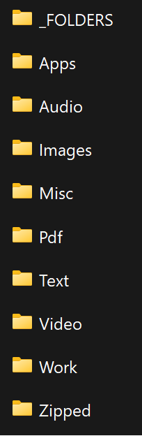

# Downloads Simplified

The downloads directory is usually the most cluttered directory on most peoples computers, and this becomes annoying and unmagable whenever you are looking an older file, for which you know the type, but can't find it buried under 100s of other random files.

This program sorts your downloads directory on **Windows** into easily managable files!

# How To Start Sorting Your Downloads

 1. Clone this repository or download it as a zip.
 2. If you downloaded it as a zip, the __'Downloads Simplified'__ folder that you've downloaded from github ***out of your Downloads***.
 3. Unzip this folder and open it, observe that there are two .exe files. 
    - If you **want your downloads to be automatically sorted on startup**:
        - Right click **DownloadsSimplified.exe**, and then **Run As Administrator**
    - If you **DONT want your downloads to be automatically sorted on startup**:
        - Right click **DownloadsSimplified-nostartup.exe**, and then **Run As Administrator**

__Now your downloads are organized!__

#### ***WARNING:*** 
**This folder is automatically recognized as a Trojan virus by windows defender, and a few other programs.** This program is ***not*** a virus, it was compiled with [pyinstaller](https://pyinstaller.org/en/stable/), this is a common occurence when using this tool *(you can scan the .exe with [virustotal](https://www.virustotal.com/gui/home/upload) to see that it is only detected by a few antivirus softwares)*.

#### To stop the detection follow these steps:

1. Turn off Realtime Protetction in Windows Security > Virus and Threat Protection > Virus and Threat Protection Settings

2. Run the program following 2 the steps above in 'How To Start Sorting Your Downloads'.  

3. If you didn't turn off Realtime Protection, you will get a Windows Defender Notification (if you have notifications off, you will need to open the notifications sidebar or open Windows Defender in settings)

4. Click the false positive Trojan that it has detected and select: **Always allow > Start Actions**  

#### Note:
 Some users might recieve 'Windows SmartScreen' dialog box in the middle of their screen saying that windows stopped the program from running because it is a virus. In this case, simple select **'More Info'** and  **'Run Anyway'**.

***If the program is not running (which you can check in task manager), and is not in your startup folder or the location you downlaoded it, Windows Defender has already deleted it. Simply run the program and repeat the steps quicker.***

# How Are Your Files Organized?

### The program sorts your downloads into 10 different folders:

**_FOLDERS**: Windows File Folder Types. 

**Apps**: Executable files like setups/installers.

**Audio**: Audio type files.

**Images**: Image type files.

**Pdf**: PDF type files.                

**Text**: Text/Code type files.

**Video**: Video type files.

**Work**: All offic type files.

**Zipped**: Zipped/rar/tar type files.

**Misc**: Any file that didn't qualify as any of the prior types, or files that you don't want to be sorted.

**The program also goes through these folder and moves any files that dont belong in that folder to the correct one.**
*If you __don't__ want a file/folder to be automatically sorted into the correct folder, put it in __Misc__*.

### **This is what your Downloads folder will look like! Wow, so organized!**

# Some Things To Consider...

- It automatically checks your downloads folder for new files every 6 hours while your computer is on. If you don't see your downloads sorted immediately after a new download, this is why *(this improves the performance of your computer as it is not checking every second).*
    - If you are interested in having this program sorting your downloads as soon as a new one is added, contact me and I can send you a modfied program. However, as mentioned above this *will slightly reduce your computer's overall performance*.
 

- If you have python installed and want to run it through there, or want to try modifying the script to your liking and then running your own version, Go into the **Python** folder and start coding!

- **This does not work for Linux or MacOS, and likely will never.**
  
# How To STOP Sorting Your Downloads AND set it back to it's original state

To stop sorting your downloads, simply run revert-sorting.exe following the run steps in 'How To Start Sorting Your Downloads', but for this exe.
**This will kill the DownloadsSimplified process, remove it from your startup folder (if it is in there), and put your downloads folder into its original disorganized state, without leaving a trace.**

# How To STOP Sorting Your Downloads, but keep your downloads directory the same

To stop sorting your downloads, open task manager and end the two 'DownloadsSimplified' tasks. 
Additionally, if you installed with the default exe 'DownloadsSimplified.exe' it will be nested in your startup folder. To remove it do: **Win + R, then type 'shell:startup', then just delete the .exe**

# Contact me
Do not hesitate to reach out to me with any questions or concerns at:
__oneilb123@gmail.com__
