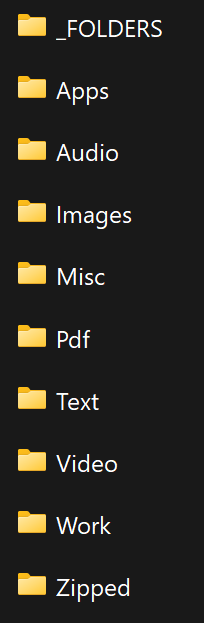

# Downloads Simplified

#### DISCLAIMER: You must have [Python](https://www.python.org/downloads/release/python-3100/) installed on your computer

The downloads directory is usually the most cluttered directory on most peoples computers, and this becomes annoying and unmagable whenever you are looking an older file, for which you know the type, but can't find it buried under 100s of other random files.

This program sorts your downloads directory on **Windows** into easily managable files!

# How to start sorting your downloads

Once it is installed, you can simply right click 'organize.pyw' > 'Open With' > *and just select python*

__Now your files are organized!__

<!-- #### ***WARNING:*** 
**This folder is automatically recognized as a Trojan virus by windows defender, and a few other programs.** This program is ***not*** a virus, it was compiled with the [auto-py-to-exe](https://pypi.org/project/auto-py-to-exe/) tool, this is a commmon issue with this program *(you can scan the .exe with [virustotal](https://www.virustotal.com/gui/home/upload) to see that it is only detected by a few antivirus softwares)*.

#### To stop the detection follow these steps:

1. Run the **Downloads Simplified.exe** file.  

2. Observe the Windows Defender Notification (if you have notifications off, you will need to open the notifications sidebar or open Windows Defender in settings)

3. Click the false positive Trojan that it has detected and select: **Always allow > Start Actions**  

***If the program is not running (which you can check in task manager), and is not in your startup folder or the location you downlaoded it, Windows Defender has already deleted it. Simply run the program and repeat the steps quicker.***

**That's it! Your downloads will now be organized!** -->

# How are your files organized?

### The program sorts your downloads into 10 different folders:

**_FOLDERS**: Windows File Folder Types. 

**Apps**: Executable files like setups/installers.

**Audio**: Audio type files.

**Images**: Image type files.

**Pdf**: PDF type files.                

**Text**: Text/Code type files.

**Video**: Video type files.

**Work**: All offic type files.

**Zipped**: Zipped/rar/tar type files.

**Misc**: Any file that didn't qualify as any of the prior types, or files that you don't want to be sorted.

#### The program also goes through these folder and moves any files that dont belong in that folder to the correct one. 
*If you __don't__ want a file/folder to be automatically sorted into the correct folder, put it in __Misc__*:

### **This is what your Downloads folder will look like! So organized!**

# **Some things to consider**

- This program nests itself in your startup folder, so that it runs whenever you turn your computer on.

- It automatically checks your downloads folder for new files every 6 hours while your computer is on. If you don't see your downloads sorted immediately after a new download, this is why *(this improves the performance of your computer as it is not checking every second).*

- **This does not work for Linux or MacOS, I am working on implementing support for each**

# Contact me
Do not hesitate to reach out to me with any questions or concerns at:
__oneilb123@gmail.com__